*******************************
How to organize your data files
*******************************

As a researcher, you are usually involved in multiple separate projects. For every project, you usually collect data from multiple animals in numerous photometry sessions. For every recording, you get various sync, log files and videos. Besides, you also have to keep track of pilot experiments, training sessions and behavioral experiments. You need to keep track of all animals and need to store other data like mouse weights or surgery dates.

When it comes to data analysis, you will produce a huge amount of intermediate files, processed data in different versions and analysis scripts. If you don't employ good data management, data loss, confusion, and errors will be unavoidable.

This problem only gets greater if you exchange data with other researchers and they need to understand how your data is structured.
To prevent these problems and to make data analysis and collaboration easier, we will describe various conventions and tipps for organizing you scientific data in this chapter.

Why should you care?
====================

Why should you invest time to structure your data? There are numerous pitfalls that can occur if you don't enforce a consistent data management. Here are a few examples:

- **data loss:** you might loose data because you don't have backups, accidentally delete or override important raw data or don't find your data on the disc
- **confusion:** you might end up finding data files that you can't map to recordings you did. Or you have a recording but don't know from which mouse with which settings it was done
- **hard to analyse:** having data organized in different formats makes it possible to programmatically process experimental datasets. If your naming is not consistent, it will be hard to read in all files.
- **loose analyses:** when you analyse your data, you usually run an analysis script dozens of times and produce or overwrite hundreds of output files. If you don't organize your findings and save them in an appropriate way, you will not find the results that you produced a week ago.
- **no collaboration possible:** If you don't organize your data in a readable way, other people won't be able to use your dataset and reanalyse, review or add to it
- **not readable:** you will find yourself looking at an experiment that you've done a few months ago and are not able to recollect how the data is organized and where important files are
- **not reusable:** you won't be able to reuse analysis scripts or data organization schemes in a subsequent experiment

How does a data processing pipeline look like?
==============================================

For every project, you should have three separate data directories:

- **raw data:** Here, you store all raw data files, including photometry recordings, log files, mouse weights, meta information, and configuration files. It is very important that you **NEVER TOUCH** this data once you stored it there. That means don't alter those files, never delete them, don't store other files there except raw data.
- **processed data:** Raw data is often unorganized and hard to analyse without data wrangling and proper preprocessing. In the 'processed data' directory, you should store processed data that is ready for analysis. Data files stored there should have a predefined and consistent structure. This includes merging data files, excluding bad data, reorganizing data, and making zdFF traces or perievents.
- **analysed data:** Here, you store analysed data like diagrams, tables, figures and plots.

Structuring data like this means that you will have separate scripts for data wrangling and data analysis.

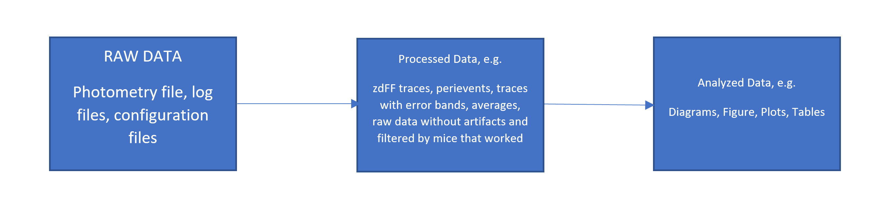

Where should data be stored?
============================

Nowadays, there are many different options where to store your data - local disc, external flash drive, lab computer, cloud - only to name a few. Different methods are suited for different requirements. Here, we want to give you some hints and help you with choosing the best method.

The most important requirement is data security: You have to be absolutely sure that your data cannot get lost. Data loss is a worst case scenario and could mean that you loose all results of many months or even years of your work.
Many researchers use ordinary HDD discs to store their data, because of the low price per GB. Considering modern research technologies, scientists often collect many GB of data per experiment. HDD are a possibility of storing up to multiple TB without spending too much money.
However, HDD usually have a limited lifetime of about 5 years and the chance of a random breakdown is about 5 % per year. This risk is not acceptable for expensive and long-lasting research projects. Modern SSDs are more secure but there is still a substantial risk of just loosing the SSD or dropping it on the floor.
To conclude, if you decide to store your data on your local computer or external storage devices, you should regularly make a backup onto another device of all your data.

Another possibility is to store data on your local device and connect it to a cloud like Onedrive, Dropbox or Google Drive. This will automatically synchronize your data with the cloud and provides a comfortable way of securing data. An advantage is that you can access your data everywhere.

You can also store your data in Google Drive and use Google Colab, an free online jupyter notebook to analyse your data.

If you have large datasets (>200 GB), you should consider moving to a cloud computing platform like AWS, GCP or Azure. There, you can save unlimited amounts of data and use their infrastructure to run you analysis scripts. This makes it possible to easily scale computing to process huge amounts of data. This will also simplify data organization and wrangling.

How to structure your data into directories
===========================================

1. **Separate code and data.** This is important because you might want to reuse code in other projects and because you want to upload your code to Git or share it with collaborators or reviewers. Having code and data mixed dramatically increases the size of your directories and makes it hard to understand the project structure.

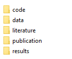

2. **Make a new directory for every experiment.**

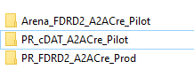

**Give short but precise and consistent names to your experiments. Here is a BAD example:**

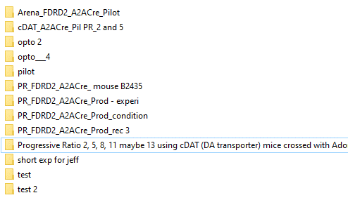

3. **Separate raw data from processed data.** As explained above, you want to keep a directory with raw data that you never touch and a structured dataset with your processed data.

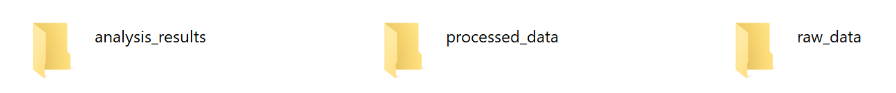

4. **Organize subexperiments and recordings in a directory tree.** Make sure to have one directory for every session (e.g. per photometry recording) where you include all files related to that recording. Then, structure all of your recording directories into a consistens directory tree. For example, you can make subdirectories for condition and controls, recording dates, or experimental paradigms.
    For example:

.. code-block:: text

    -- control
           -- Day1
                -- Recording1
                     photometry.csv
                     logfile.logs
                -- Recording2
           -- Day2
           ...
    -- condition
           -- Day1
           ...
           -- Day2

How to organize Neurophotometrics data
======================================

Make a separate folder for each recording. One recording is one Neurophotometrics recording with one output data file (note that there can be multiple mice per session, because Neurophotometrics can record from several patch cables simultaneously).
In this folder, put the following files:

- the recording file with the measured light intensities. Name the file the same in every recording directory, for example "photometry.csv"
- behavior logs, for example if mice press levers, then the timestamps of the lever presses for each mouse. There might be multiple logs files per photometry recording if data is collected from multiple mice at the same time or if multiple sensors produce separate log files. As a convention, choose ".log" as the file extension.
- a file with the name "region_to_mouse.csv", see explanation below.
- "time.csv", a Bonsai file with the system times for each photometry frame, this might be needed for synchronization
- [optional] files recorded by the photometry system about inputs and outputs, for example "input1.csv", "input2.csv" or "output1.csv"
- [optional] supplementary files like automatically calculated stat files or files from the Bonsai software
- [optional] videos or other datastreams collected
- [optional] timestamps of optogenetic stimulation
- [optional] meta information and configuration such as mouse weights, experimental paradigm used, etc.

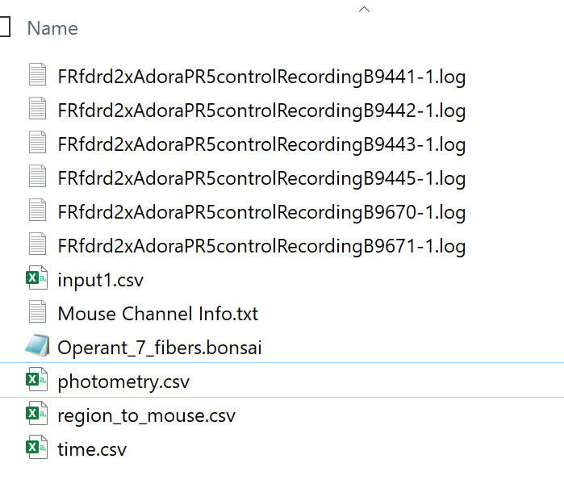

Keep track of which mouse was connected where
=============================================

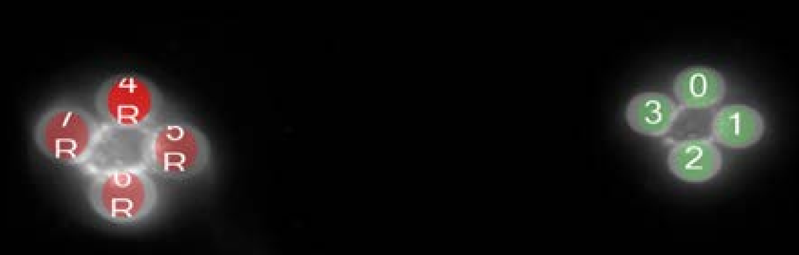

If multiple mice are recorded per session, you set up regions of interest in Bonsai to tell the system which cable is displayed in what region of the camera image. To know which region connects to what mouse and to what log file, fibermagic needs a mapping between regions of interest and mouse number for each recording.
To do this, create a single "region_to_mouse.csv" file for every recording, using "," as the csv delimiter. The file should look like this:

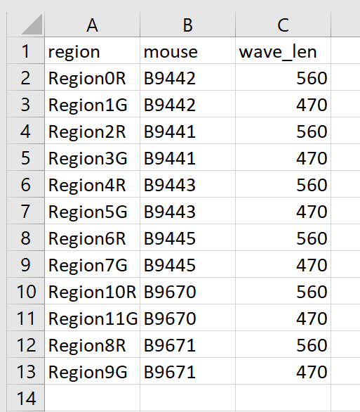

Troubleshoot Neurophotometrics data
===================================

It sometimes happens that datafiles are corrupted or not in the right format. To efficiently process your data using fibermagic, you need to fix eventual data formatting issues. Here are some of the most common issues listed:

- **Double headers:** a datafile has a faulty header.

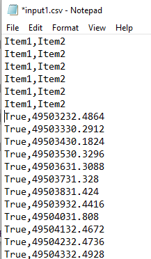

- **Inconsistent headers:** headers are different between multiple recording sessions

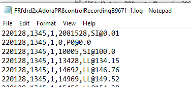

- **Framedrops:** the photometry machine fails to collect data for some frames

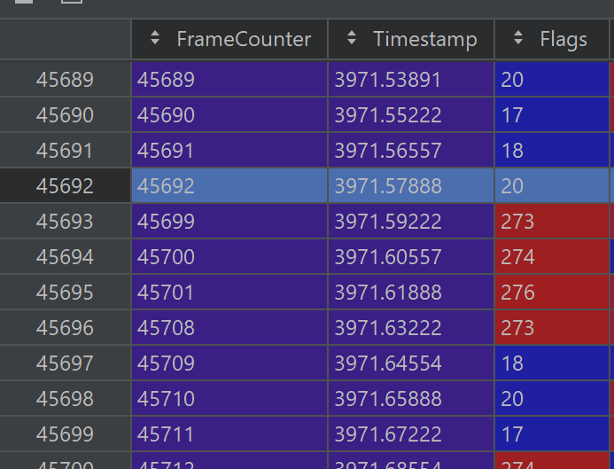

- **Inconsistent naming:** file names, or file naming conventions are not consistent across different sessions

Example Datasets
================

We've uploaded two example datasets that work well with fibermagic and are well-structured. Feel free to have a look!

- `Pilot progressive ratio experiment <https://drive.google.com/drive/folders/1VR_2f5ZIQA9ZgT2mRAwmRhkJCzeMzBcC?usp=sharing>`_
- `Progressive ratio experiment <https://drive.google.com/drive/folders/1V9SBvm-b3vMniIJUE1ZfP73hM9nV7Wt_?usp=sharing>`_